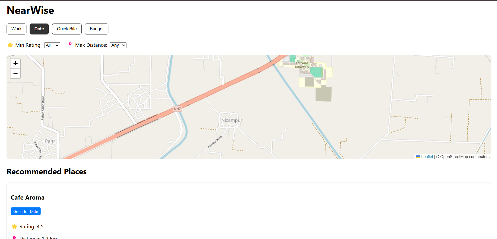

# NearWise

NearWise is a smart location-based recommendation app that suggests nearby places
based on user mood, distance, and preferences.

## 🚀 Features
- Mood-based recommendations (Work, Date, Quick Bite, Budget)
- Location-aware suggestions using browser geolocation
- Weighted scoring & ranking logic
- Explainable recommendations ("Why recommended?")
- Interactive map using OpenStreetMap
- Graceful fallback using mock data

## 🛠 Tech Stack
- React
- OpenStreetMap (Leaflet)
- Overpass API
- JavaScript
- CSS

## 🧠 How it Works
1. Fetches user location using the browser Geolocation API
2. Retrieves nearby places using OpenStreetMap (Overpass API)
3. Applies intent-based visibility and user-selected filters
4. Calculates a weighted score for each place
5. Ranks places and displays them on both map and list view

## ⚠️ API Note
Google Places API requires billing to be enabled.
To avoid mandatory billing, this project uses OpenStreetMap for live data
and mock data as a fallback while maintaining an API-ready architecture.

## 📸 Screenshots

### Home View


### Filters & Mood Selection


## 📦 Setup Instructions
```bash
npm install
npm start