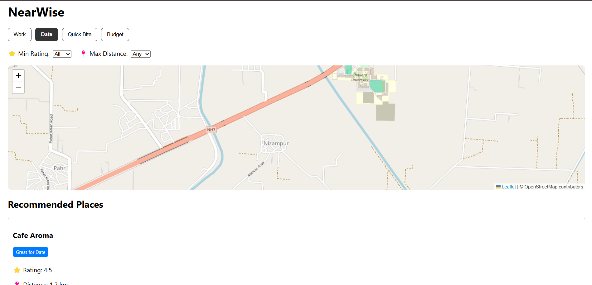
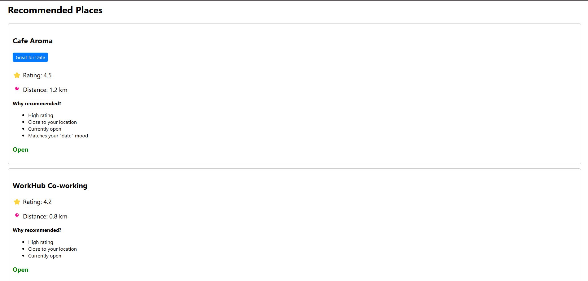

# NearWise 🗺️

> **Mood-based place discovery** — find the perfect nearby café or restaurant based on how you're feeling right now.

[](https://github.com/AnuragBhashkar/nearwise/actions)


---

## 🎯 What it does

Pick your mood. NearWise fetches real nearby places from OpenStreetMap, runs them through a **weighted scoring algorithm**, and ranks results so the most relevant place for your intent always floats to the top.

| Mood | What it prioritises |
|------|---------------------|
| 💼 **Work Mode** | Quiet cafés, open now, proximity |
| 🕯️ **Date Night** | High ratings, restaurants & cafés |
| ⚡ **Quick Bite** | Closest open places, fast-food boost |
| 💸 **Budget** | Cheapest price level wins |

---

## ✨ Features

- **Mood-aware ranking** — a custom scoring algorithm re-ranks results per mood
- **Live data from OpenStreetMap** — no Google Maps billing, ever
- **Real distance calculation** — Haversine formula, not guesses
- **Interactive Leaflet map** — all results pinned with rich popups
- **Explainability** — every card shows *why* it was recommended
- **Graceful fallback** — mock data keeps the UI alive when location or the API is unavailable
- **Accessible** — ARIA roles, labels, and keyboard-navigable controls

---

## 🛠 Tech Stack

| Layer | Technology |
|-------|------------|
| UI Framework | React 19 |
| Mapping | Leaflet + react-leaflet |
| Live Place Data | OpenStreetMap (Overpass API) |
| Styling | Vanilla CSS (dark design system) |
| Distance | Haversine formula |
| Deployment | Vercel / Docker + nginx |
| CI | GitHub Actions |

---

## 🏗 Architecture

```
src/
├── constants/
│   ├── moods.js          # Single source of truth for mood definitions
│   └── config.js         # API URL, radius, timeout, score weights
│
├── hooks/
│   ├── useGeolocation.js # Browser Geolocation API wrapper
│   └── usePlaces.js      # Fetching → filtering → scoring → ranking pipeline
│
├── services/
│   └── placesService.js  # Overpass API client (fetch + normalize)
│
├── utils/
│   ├── distanceUtils.js  # Haversine formula
│   ├── scoringLogic.js   # Weighted mood-based scoring algorithm
│   └── fixLeafletIcon.js # Leaflet default icon path fix for webpack
│
├── components/
│   ├── MoodSelector.jsx  # Emoji mood card grid
│   ├── FilterBar.jsx     # Rating + distance filters
│   ├── MapView.jsx       # Leaflet map with place markers
│   ├── PlaceCard.jsx     # Ranked card with score bar + explainability
│   ├── LoadingScreen.jsx # Full-page loading state
│   └── ErrorScreen.jsx   # Geolocation error with retry
│
├── data/
│   └── mockPlaces.js     # Fallback data (used when API/location unavailable)
│
└── App.jsx               # Layout only — logic delegated to hooks
```

### Scoring Algorithm

```
score = rating × 0.4 + (5 − distance) × 0.3 + mood_bonus
```

| Mood | Bonus rules |
|------|-------------|
| Work | +1.5 for cafés, +0.5 if open now |
| Date | rating × 0.3 extra, +1.0 for restaurants/cafés |
| Quick | −5 if closed (hard cut), +1.0 for fast food, proximity × 1.0 |
| Budget | +(4 − priceLevel) × 0.6 |

---

## ⚠️ API Note

This project **deliberately avoids the Google Places API** (which requires billing to be enabled).

Instead, it uses the free [Overpass API](https://overpass-api.de/) to query OpenStreetMap data. Ratings and price levels are approximated as honest placeholders since OSM does not provide them.

---

## 🚀 Quick Start

```bash
# Clone
git clone https://github.com/AnuragBhashkar/nearwise.git
cd nearwise

# Install
npm install

# Run locally
npm start
```

Open [http://localhost:3000](http://localhost:3000) and allow location access when prompted.

---

## 🐳 Docker

```bash
# Build the image
docker build -t nearwise .

# Run on port 8080
docker run -p 8080:80 nearwise
```

Open [http://localhost:8080](http://localhost:8080).

The Docker build is multi-stage:
- **Stage 1** (`node:20-alpine`) — installs dependencies and runs `npm run build`
- **Stage 2** (`nginx:stable-alpine`) — serves the static build with gzip, caching, and SPA routing

---

## ☁️ Deploy to Vercel

```bash
# Install Vercel CLI
npm i -g vercel

# Deploy (follow prompts)
vercel
```

Or connect the GitHub repo in the [Vercel dashboard](https://vercel.com) — it auto-detects the `vercel.json` config with:
- SPA rewrite rules
- Immutable static asset caching
- Security headers (X-Frame-Options, X-Content-Type-Options)

---

## 🧪 Tests

```bash
npm test
```

Unit tests cover the scoring algorithm across all 4 moods — verifying that the right type of place rises to the top for each intent.

---

## 📸 Screenshots

| Home View | Mood Selection |
|-----------|----------------|
|  |  |

---

## 📦 Environment Variables

No API key is required. The `.env.example` file shows optional future configuration:

```env
# Optional — reserved for future Google Places API integration
REACT_APP_GOOGLE_MAPS_API_KEY=your_api_key_here
```

---

## 📄 License

[MIT](LICENSE) © 2024 NearWise